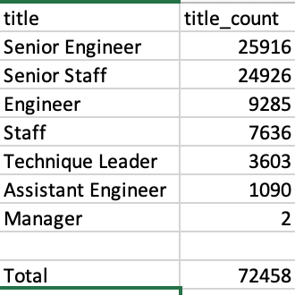
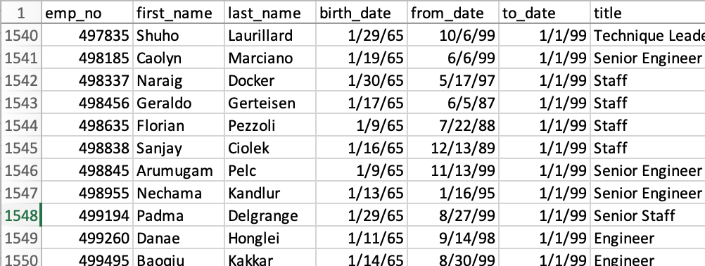

# Pewlett-Hackard-Analysis

## Overview

This analysis is being conducted in order to get a picture of how many employees at Pewlett-Hackard are apporaching expected retirement age and in what departments these individuals work in order to gain an understanding of what departments may soon encounter difficulties with staffing in the face of this so-called 'silver tsunami.' As a possible counter to this data point we have also determined a pool of employees who are not quite at, but approaching, retirement age, and could pivot to a part-time mentor role in the company, utilizing their experience and expertise to prepare the expected influx of new hires to adequately replace them when their proper, full retirement does come.

## Results

-There are a total of 72458 employees who are nearing their retirement according to the parameters established in this analysis, that being the age of the employees in question.

-Of those 72458 employees, 50842 have the title of senior member of staff, 3603 are titled as leaders, and 2 of them are department managers.

-There are a total of 1549 employees, indicated by the total rows in the .csv filtering by birth date, who are approaching retirement age. These employees could be considered for a mentorship program where they serve a part-time role that allows them to pass on knowledge to the new hires who will have to be brought on to replace the thousands of employees who will leave in retirement.

-Even if all of these employees agreed to join a mentorship program, that would still require all of them to serve as a mentor for approximately 47 new hires. While this is not how the program would function in reality, it does serve to highlight the discrepancy between the two groups and the large amount of work that must be put in to replace the group headed towards retirement.

## Summary

The analysis conducted here makes it plain that Pewlett-Hackard is inching towards a staffing crisis. While not all of the more than 72458 employees will retire in a single instance, they will no longer be employed here sooner rather than later, and while the idea of creating a team of mentors to bridge the gap and prepare the newly hired employees to fill the soon-to-be vacant roles is sound, the math simply does not add up. 1549 individuals cannot prepare 72458 fresh faces for the tasks that will be expected of them, especially if they are to replace what is a group largely comprised of senior staff, especially from a part-time role. What this analysis indicates is that additional steps must be taken to ensure that these roles are not left unoccupied when these retirements do occur. One stpe that could be tkaen with the data present is deptermining how many of the group being considered for mentorship are senior staff, as they would hopefully be better prepared to function as mentors for new hires given their elevated position and expected additional knowledge. It would also be worth looking into the relative spread of salaries amongst the expected retirees to see how much expected payroll will be coming off the books and give a picture of how much can be spent on the new hires that will have to begin coming in the doors. There are numerous valuable bits of information that can be gleaned from this data but the overall picture is clear; Pewlett-Hackard needsto start investing into the future workforce of the company or the 'silver tsunami' will severely diminish our ability to function at the level we do now and expect to beable to in the future.
